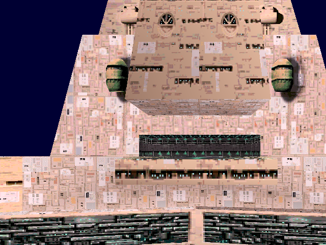
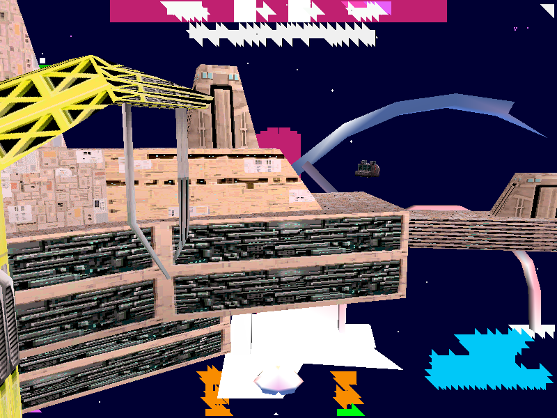

# X-Wing Alliance Static Recompilation

A static recompilation of **Star Wars: X-Wing Alliance** (1999, Totally Games / LucasArts) to native
Windows: the game's x86 code is lifted to C by our own toolchain and linked against a Win32/DirectX
HAL with a Direct3D 11 renderer. You supply your own copy of the game; nothing from it is in this repo.

## Status

**Alpha.** Boots, runs the full frontend, and flies the first single-player campaign mission
(`1b0m1fw`, the Azzameen family-station mission) in the mission's own craft, the YT-1300, with the
game's own HUD and objectives. Not playable end to end yet: the hangar launch is not driven, and
audio and much game logic are untested.

Regression suite (`tools/run_tests.sh`): **23 passed, 1 failed** -- the failure is a known
intermittent crash (see [docs/building.md](docs/building.md)).

| Phase | Status | Description |
|-------|--------|-------------|
| **Phase 0** | **Complete** | Binary analysis, PE parsing, section mapping |
| **Phase 1** | **Complete** | SafeDisc decryption, memory dump from runtime |
| **Phase 2** | **Complete** | Function discovery (2,674 functions, 443,224 instructions) |
| **Phase 3** | **Complete** | x86-to-C code generation (2,701 functions, 606,424 lines of C) |
| **Phase 4** | **Complete** | Compilation and linking (0 errors, 1 warning) |
| **Phase 5** | **Complete** | Runtime execution — CRT init, import bridging, game startup |
| **Phase 6** | **Complete** | Win32/DirectX HAL — COM mocks operational, main loop running |
| **Phase 7** | **Complete** | D3D11 rendering backend — device, shaders, execute buffer parser, 2D surface pipeline |
| **Phase 8** | **Complete** | Frontend + concourse rendering — pilot creation, the fully-rendered Azzameen concourse room (backdrop, Emkay droid, holo-globe, animated doors), mouse hover/click input |
| **Phase 9** | **Complete** | Menu navigation + flight entry — pilot creation → concourse → Combat Simulator → skirmish setup → mission load → flight, with a real 20-flight-group mission and a crash-free flight loop presenting frames |
| **Phase 10** | **In Progress** | **Visible 3D flight** — texture-mapped spacecraft rendered from the game's own OPT models, in a starfield, with perspective, per-face lighting and backface culling (see *3D Flight* below). Remaining: transparency, full flight-group population, the engine's own camera, audio, game logic |
| **Phase 11** | **In Progress** | **Single-player campaign** -- mission `1b0m1fw` loads through the engine's own barracks -> loading -> flight route, builds the player craft record, and plays mission 1 end to end: hangar, launch, flight, debrief, the campaign advances and mission 2 loads. See [docs/campaign.md](docs/campaign.md) |

## Screenshots

**First campaign mission** -- the Azzameen family base in `1b0m1fw` at true model scale, after launch:



Docked in the family base's hangar before launch (only the player's region is drawn):



**Texture-mapped spacecraft in flight** — rendered from the game's own OPT model data: real faces,
per-face normals for lighting and backface culling, and the original 1999 textures point-sampled onto
the hull. Every object in the world is drawn with its own model, loaded on demand from the game's
craft list. The cyan flight HUD is the game's own:


<details>
<summary>Getting there: one ship, then textures, then a populated world</summary>


*A Y-wing with its 1999 hull textures — the first craft rendered with real faces and materials.*


*Correct geometry with flat shading, before textures — the same Y-wing plus a second craft.*


*Earlier: the first correctly-placed craft with a starfield, before the face-index stride was fixed.*


*And before that — the first flight frame that was not black at all.*
</details>


The recompiled game boots, creates a pilot, and navigates the full frontend — each screen rendered from the original game's assets via the recompiled 2D pipeline and D3D11 backend.

**Combat Simulator menu** — reached by navigating from the concourse through the Combat Simulator door. Fully composited backdrop with live menu labels (highlighted *Single Player*, plus *Multiplayer*, *Film Room*, *Back to Family Transport*):


**Concourse room** — the Azzameen family-home concourse: room backdrop, the Emkay (MK-09) droid, the holographic galaxy globe, the animated doors, and the highlighted "Play Mission" label:


**Pilot creation** — the entry screen: starfield nebula with lens flare, the Empire and Rebel faction crests, and the "Create a new pilot." / "Create Pilot" text and input field drawn from the `fronttxt.txt` string table:


<details>
<summary>Earlier concourse captures</summary>


*An earlier concourse capture showing the highlighted "Combat Simulator" door label. Reaching this required fixing a joystick-detection gate, the `.lst` resource-list parser, a `test`-after-reload codegen bug in the recompiler, and an unresolved jump-table in the `.dat` image decoder.*


*Earlier pilot-creation capture — full background, holographic globe, Empire/Rebel faction symbols via RLE-decoded CBM surfaces.*
</details>

## Getting Started

There is no one-click setup script yet ([ROADMAP](ROADMAP.md)). The step-by-step route:

1. **Prerequisites.** Windows 10/11, Visual Studio 2022 with the C++ x86 tools, CMake 3.20+,
   Python 3.10+ with `pip install capstone pefile`, and Git Bash (the run scripts are POSIX sh).
   Use `py`, not `python`, if the Microsoft Store alias answers `python`.
2. **Own the game.** Install the Steam release of Star Wars: X-Wing Alliance. Put (or link) the
   install folder next to this checkout as `../Star Wars X-Wing Alliance`.
3. **Decrypt the executable.** The Steam build's `.text` is SafeDisc-encrypted and only decrypted in
   memory. Launch the game through Steam, then:
   ```
   python tools/dump_memory.py --pid <PID> "path/to/xwingalliance.exe" config/xwingalliance_decrypted.exe
   ```
4. **Generate the C** (local only, gitignored; also writes `config/functions.json`):
   ```
   python -m tools config/xwingalliance_decrypted.exe --all -o src/game/recomp/gen
   python -m tools.apply_hooks
   ```
5. **Build** -- see [Building from source](#building-from-source).
6. **Run.** `tools/play.sh` starts the game with the knobs the flight path currently needs and logs
   to `../Star Wars X-Wing Alliance/play.log`. Expected: the pilot screen, then the concourse.

## Usage

```
tools/play.sh                         # play by hand, no timeout, logs to play.log
tools/play.sh XWA_NODPSP=1            # add or override any XWA_* knob
tools/run_tests.sh                    # regression suite (all 7 tests)
tools/run_tests.sh 3 7                # just the campaign-path tests
tools/run_engine_flight.sh            # scripted campaign mission load, retried, with captures
```

Behaviour is steered by `XWA_*` environment variables read in `src/game/main.c`. The ones that
matter for the campaign path, and what each fix default-on does, are in
[docs/campaign.md](docs/campaign.md).

## Building from source

```bash
# Generate recompiled code (requires decrypted binary)
python -m tools config/xwingalliance_decrypted.exe --all -o src/game/recomp/gen

# Configure and build -- BOTH flags below are required, see note
cmake -B build -G "Visual Studio 17 2022" -A Win32 -T host=x64
cmake --build build --config Release
```

Both `-T host=x64` and the `/MP` in CMakeLists.txt are required -- the generated tree is ~38 MB of C.
Read [docs/building.md](docs/building.md) before debugging a build failure.

On [recomp-netlab](https://github.com/sp00nznet/recomp-netlab) (recipe `projects/xwa.env`):
`netlab build xwa` compiles on the clang-cl farm in about 35 s, and `netlab run xwa --on testbox`
runs the campaign mission load on the test VM. The VM needs the game install, with
`xwingalliance_decrypted.exe` copied in, at its `XWA_GAME`.

## Generated-code hooks

`src/game/recomp/gen/` is produced from the PE and is gitignored, so the env-gated hooks added to
it do not survive a regeneration. The ones worth keeping live in `tools/hooks/*.hook`, anchored to
a line of generated code rather than a line number:

```bash
python -m tools.apply_hooks --check   # report status, change nothing
python -m tools.apply_hooks           # re-apply anything missing
```

`tools/run_tests.sh 6` fails if an anchor stops matching, which is the signal that the generator's
output moved and a hook needs re-deriving.

## Documentation

- [docs/architecture.md](docs/architecture.md) -- toolchain, runtime, register/memory model
- [docs/campaign.md](docs/campaign.md) -- the single-player campaign bring-up, current blocker
- [docs/building.md](docs/building.md) -- build and test traps
- [docs/bringup.md](docs/bringup.md) -- history: boot to flight
- [docs/lifter-audit.md](docs/lifter-audit.md) -- known lifter bugs vs upstream pcrecomp, with site counts

## License

The code in this repository is released under the [MIT License](LICENSE).

That covers **this project's own source** — the recompilation toolchain, the HAL, the COM mocks and
the native render path. It does **not** cover Star Wars: X-Wing Alliance itself: the game's binary,
assets and data remain the property of their respective owners and are not distributed here.

Generated source is **not distributed**: `src/game/recomp/gen/`, `config/functions.json` and other
tables derived from the game binary are produced locally and gitignored.

## Legal

This project is for game preservation purposes. You must own a legal copy of Star Wars: X-Wing Alliance to use this tool. No copyrighted game assets are included in this repository.

## Related Projects

Part of the [sp00nznet](https://github.com/sp00nznet) recompilation collection. See also:
- [burnout3](https://github.com/sp00nznet/burnout3) — Original Xbox x86 recomp (reference for x86-to-C lifter)
- [bw](https://github.com/sp00nznet/bw) — Black & White Win32 recomp (reference for Win32 game patterns)
- [civ](https://github.com/sp00nznet/civ) — Civilization DOS recomp (reference for 16-bit x86 lifting)
- [pcrecomp](https://github.com/sp00nznet/pcrecomp) -- the shared PC recomp toolkit; `tools/lifter.py` here is an older fork of its `lift32.py`
