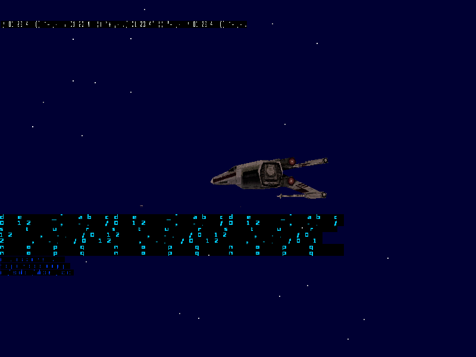
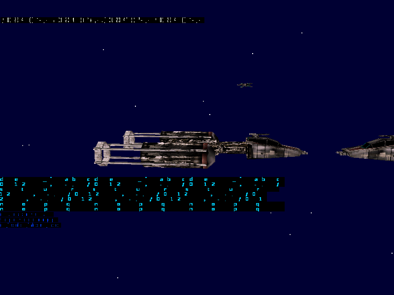
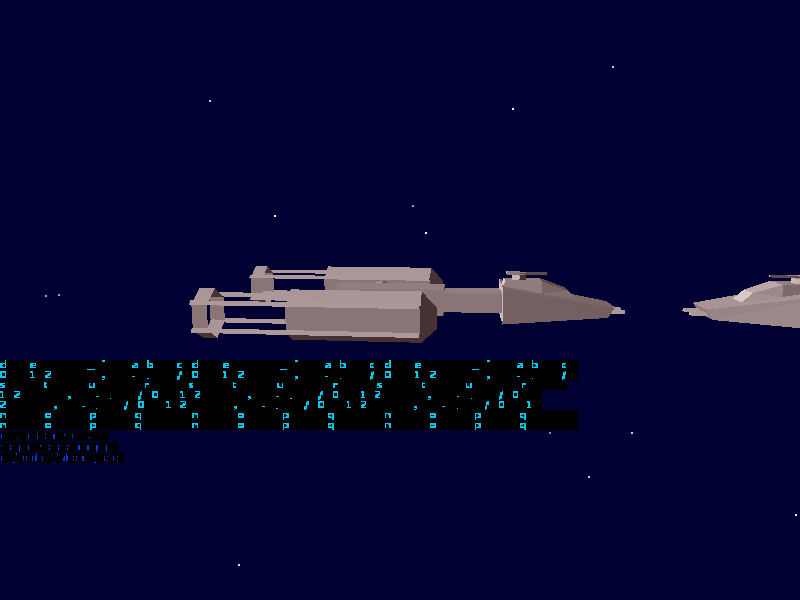
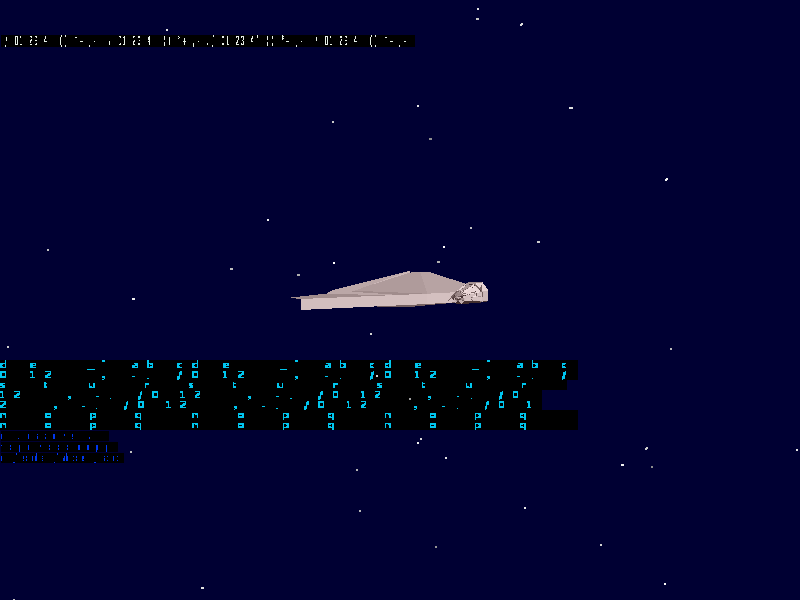
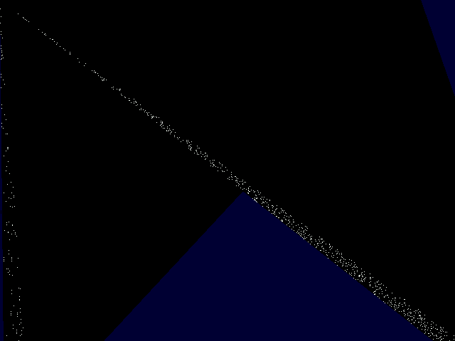
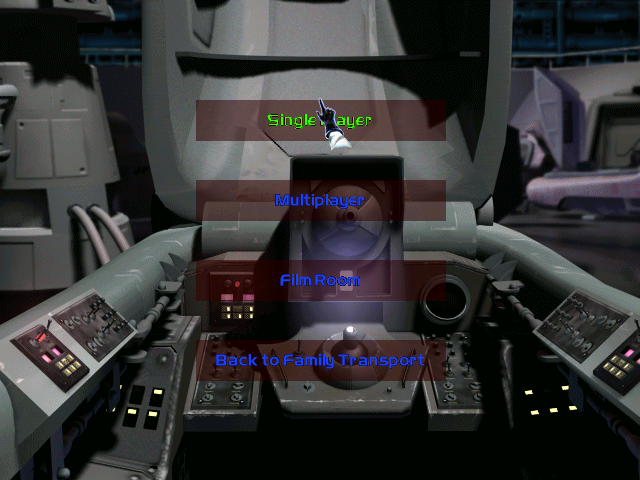
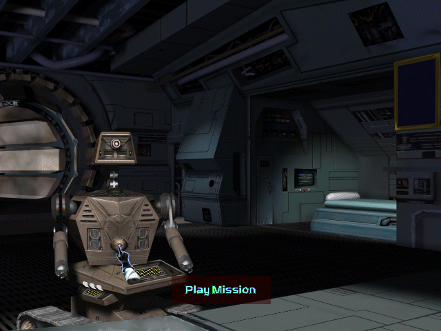
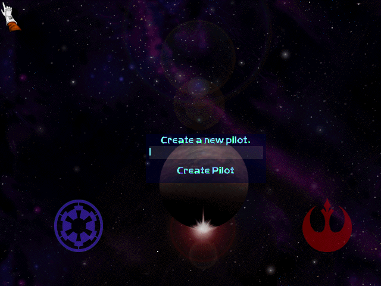
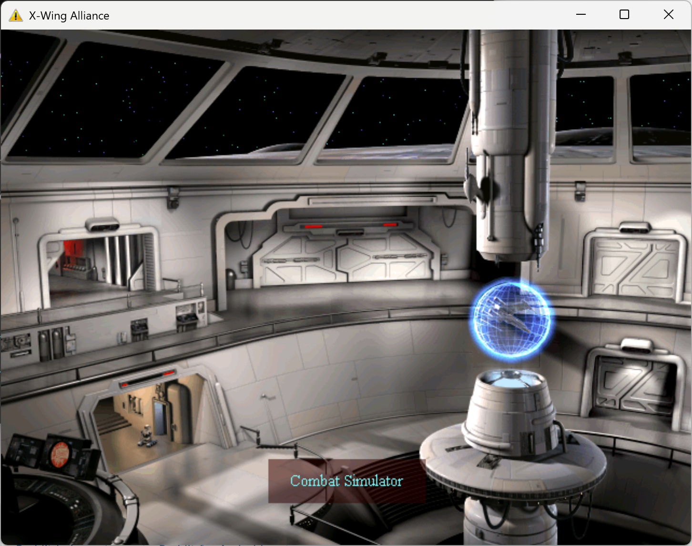
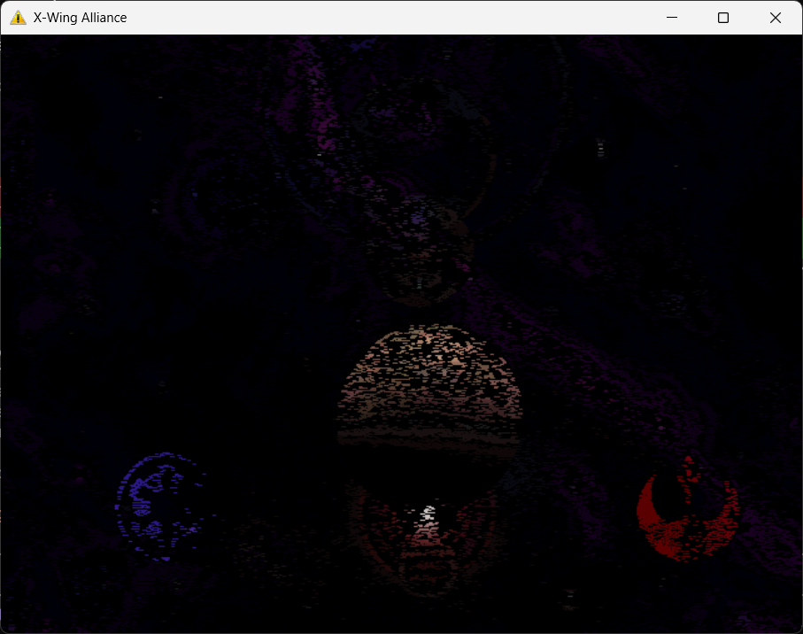

# X-Wing Alliance Static Recompilation

A static recompilation of **Star Wars: X-Wing Alliance** (1999) by Totally Games / LucasArts, targeting modern Windows with native x86 execution and a modern graphics pipeline.

## Project Status

| Phase | Status | Description |
|-------|--------|-------------|
| **Phase 0** | **Complete** | Binary analysis, PE parsing, section mapping |
| **Phase 1** | **Complete** | SafeDisc decryption, memory dump from runtime |
| **Phase 2** | **Complete** | Function discovery (2,674 functions, 443,224 instructions) |
| **Phase 3** | **Complete** | x86-to-C code generation (2,701 functions, 606,424 lines of C) |
| **Phase 4** | **Complete** | Compilation and linking (0 errors, 1 warning) |
| **Phase 5** | **Complete** | Runtime execution — CRT init, import bridging, game startup |
| **Phase 6** | **Complete** | Win32/DirectX HAL — COM mocks operational, main loop running |
| **Phase 7** | **Complete** | D3D11 rendering backend — device, shaders, execute buffer parser, 2D surface pipeline |
| **Phase 8** | **Complete** | Frontend + concourse rendering — pilot creation, the fully-rendered Azzameen concourse room (backdrop, Emkay droid, holo-globe, animated doors), mouse hover/click input |
| **Phase 9** | **Complete** | Menu navigation + flight entry — pilot creation → concourse → Combat Simulator → skirmish setup → mission load → flight, with a real 20-flight-group mission and a crash-free flight loop presenting frames |
| **Phase 10** | **In Progress** | **Visible 3D flight** — texture-mapped spacecraft rendered from the game's own OPT models, in a starfield, with perspective, per-face lighting and backface culling (see *3D Flight* below). Remaining: transparency, full flight-group population, the engine's own camera, audio, game logic |

### Screenshots

**Texture-mapped spacecraft in flight** — rendered from the game's own OPT model data: real faces,
per-face normals for lighting and backface culling, and the original 1999 textures point-sampled onto
the hull. Every object in the world is drawn with its own model, loaded on demand from the game's
craft list. The cyan flight HUD is the game's own:



<details>
<summary>Getting there: one ship, then textures, then a populated world</summary>



*A Y-wing with its 1999 hull textures — the first craft rendered with real faces and materials.*



*Correct geometry with flat shading, before textures — the same Y-wing plus a second craft.*



*Earlier: the first correctly-placed craft with a starfield, before the face-index stride was fixed.*



*And before that — the first flight frame that was not black at all.*
</details>


The recompiled game boots, creates a pilot, and navigates the full frontend — each screen rendered from the original game's assets via the recompiled 2D pipeline and D3D11 backend.

**Combat Simulator menu** — reached by navigating from the concourse through the Combat Simulator door. Fully composited backdrop with live menu labels (highlighted *Single Player*, plus *Multiplayer*, *Film Room*, *Back to Family Transport*):



**Concourse room** — the Azzameen family-home concourse: room backdrop, the Emkay (MK-09) droid, the holographic galaxy globe, the animated doors, and the highlighted "Play Mission" label:



**Pilot creation** — the entry screen: starfield nebula with lens flare, the Empire and Rebel faction crests, and the "Create a new pilot." / "Create Pilot" text and input field drawn from the `fronttxt.txt` string table:



<details>
<summary>Earlier concourse captures</summary>



*An earlier concourse capture showing the highlighted "Combat Simulator" door label. Reaching this required fixing a joystick-detection gate, the `.lst` resource-list parser, a `test`-after-reload codegen bug in the recompiler, and an unresolved jump-table in the `.dat` image decoder.*



*Earlier pilot-creation capture — full background, holographic globe, Empire/Rebel faction symbols via RLE-decoded CBM surfaces.*
</details>

### Runtime Progress

The recompiled binary boots through full initialization, loads game assets, and renders the concourse menu:

- **Stable main loop**: 29M+ PeekMessage calls per 15-second run, zero crashes
- **VC6 CRT initialization**: heap, locks, stdio, atexit all functional
- **Native file I/O**: All game CRT file functions replaced with host CRT (fopen/fgets/fclose/fseek/ftell/fread/fwrite) — original MSVC 6.0 FILE* struct layout incompatible with modern CRT
- **String tables loaded**: strings.txt (184KB, ~1,500 game strings) and fronttxt.txt (47KB, menu labels) parsed correctly
- **Text rendering**: GDI font glyph capture (.abp files), pixel-level text drawing on concourse surfaces
- **39 .dat resource files** + **CBM concourse backgrounds** loaded successfully
- **Window creation**: "X-Wing Alliance" window at 1920x1080 (native resolution)
- **DirectX COM mocks**: Full mock objects for IDirectDraw, IDirectDrawSurface, IDirect3D, IDirect3DDevice, IDirectInput, IDirectInputDevice, IDirectSound, IDirectSoundBuffer (178 vtable bridges)
- **357 total bridges** registered (179 Win32 API + 178 COM vtable)
- **48 manual overrides** including 6 callback functions missed by code generator
- **Callee-saved register protection**: g_ebx/g_esi/g_edi automatically preserved across all calls
- **6 SafeDisc-encrypted jump tables** reconstructed with switch/goto
- **D3D11 rendering backend**: Device (feature level 11.0), swap chain, HLSL shaders, execute buffer parser, texture manager, 2D surface blit (RGB565→BGRA8)
- **2D rendering pipeline**: CBM RLE decode → offscreen surface → BltFast → back buffer → D3D11 upload → present. ~32% surface coverage per frame
- **Source color keying**: SetColorKey + BltFast DDBLTFAST_SRCCOLORKEY support for transparent sprite compositing
- **Concourse menu with text**: Background nebula, holographic globe with lens flare, Empire/Rebel faction symbols, and text labels ("Create Pilot", "Fly Solo", etc.) all rendering correctly. 70% pixel coverage via RLE-decoded CBM surfaces with 16-bit palette lookup

### Fixes Applied During Runtime Bringup

| # | Fix | Impact |
|---|-----|--------|
| 1 | SafeDisc function stubs (4 encrypted functions) | Bypass copy protection checks |
| 2 | SafeDisc jump table reconstruction (6 switch statements) | Correct control flow in CRT + game |
| 3 | Null function pointer guard (ICALL(0) → no-op) | Prevent crash on null callback |
| 4 | Retry/fail dialog stub (sub_00433C50 → returns 'F') | Avoid infinite retry loop |
| 5 | SBH (small block heap) disabled, heap handle set | Use system heap instead of VC6 SBH |
| 6 | 36 CRT lock objects pre-initialized | Multi-threaded CRT support |
| 7 | `_initstdio` manual implementation | stdin/stdout/stderr FILE structs |
| 8 | VEH crash handler with ring buffer trace | Diagnostics for runtime crashes |
| 9 | `TEST x,x; jge/jg/jle` codegen fix (1,122 instances) | Correct signed-negative checks |
| 10 | `repne scasb` / `repe cmpsb` codegen fix (961 instances) | Correct string operations |
| 11 | `TEST x,x; jbe/ja` codegen fix (208 instances) | Correct unsigned flag checks |
| 12 | `DEC x; jcc` codegen fix (1,205 instances) | Compare result vs 0, not 1 |
| 13 | COM mock infrastructure (IDirectDraw, IDirect3D, etc.) | Game passes DirectX init |
| 14 | Callee-saved register protection in RECOMP_CALL | Fixes systemic ebx/esi/edi corruption |
| 15 | 6 callback function manual overrides | Missed entry points for function pointers |
| 16 | Watchdog uses TerminateProcess (avoids loader lock) | Clean shutdown on hang |
| 17 | D3D11 rendering backend (device, shaders, pipeline) | Modern GPU rendering via execute buffer translation |
| 18 | IDirect3DTexture mock with GetHandle/Load | Texture handle tracking for execute buffer rendering |
| 19 | Native CRT file I/O (8 VFS functions replaced) | Game's recompiled CRT was corrupted; host CRT works |
| 20 | `rep stosw` implementation (32 instances) | RLE pixel fill was silently no-op'd |
| 21 | Display BPP global (0x9F700A) initialization | All 2D blit functions use this for 8/16bpp path selection |
| 22 | `test REG; mov REG; jcc` codegen fix | Flag evaluation used wrong (post-mov) register value |
| 23 | BltFast surface copy implementation | Offscreen→back buffer compositing for menu rendering |
| 24 | Source color keying (SetColorKey + BltFast) | Transparent sprite compositing via DDBLTFAST_SRCCOLORKEY |
| 25 | Font file loading (.abp format) | times0/2/5.abp loaded for concourse text rendering |
| 26 | Inner timing loop + callback dispatch | Nested event loop at 24fps with registered menu callbacks |
| 27 | `AND reg, imm; jcc` codegen fix (25 instances) | RLE literal pixel copy was completely skipped — concourse went from 23% to 70% pixel coverage |
| 28 | `test reg; mov reg; jcc` codegen fix (3 BPP instances) | BPP dispatch used wrong register value after mov overwrote flags source |
| 29 | `_old_` variable scoping fix (lifter + generator) | Block-scoped declarations broke across goto labels; moved to function scope |
| 30 | Game CRT file I/O native replacements (7 functions) | MSVC 6.0 FILE* layout differs from host CRT — ftell returned -1, crashing string parser |
| 31 | String table loading (strings.txt + fronttxt.txt) | 184KB game strings + 47KB menu labels parsed and available for text rendering |

## 3D Flight (Phase 10, in progress)

The recompiled game now flies: it drives the skirmish launch path into the flight engine, loads a real
`.tie` mission, and renders **texture-mapped craft in space**.

**How the geometry gets drawn.** The lifted model renderer (`sub_00442F70`) turned out to be
unreachable in this port — it is fed by a node-type dispatch that never sees a valid node, and nothing
in the port had ever exercised that path (the concourse uses an entirely different renderer, so there
was no working reference to diff against). Rather than keep chasing it, the port takes the standard
recompilation fallback: **replace the render path that cannot be lifted, using the game's own loaded
data.** A native D3D11 path walks each object's OPT model out of guest memory and submits it directly.
It is env-gated (`XWA_NATIVEDRAW`); the default build is unchanged.

**What renders today:**

- **Craft built from the real OPT models** — each object resolves its own model through the engine's
  own resource table, and every mesh root in that model is walked (a Y-wing is six).
- **Real faces**, not a vertex-order wireframe: the OPT face record is decoded properly, including the
  quad/triangle distinction.
- **Per-face normals** from the model, used for flat shading and backface culling.
- **The original textures**, taken from the 16-bit surfaces the engine itself converted them into, and
  **point-sampled** — these are 8×8 to 128×64 textures stretched over whole hull panels, so bilinear
  filtering smears them into what looks like shiny lighting instead of panel detail.
- **Perspective projection** matching the engine's own focal scale, with a depth buffer, plus a
  starfield so the scene reads as space.

**The OPT runtime format, as decoded for this** (byte-packed, 2-byte aligned — every node is
`+0x00 = 0`, `+0x04 = type`, `+0x08 = child count`, `+0x0C = child array`, `+0x10 = count`,
`+0x14 = inline data`):

| Node | Meaning | Layout notes |
|------|---------|--------------|
| 3 | Mesh vertices | `count` xyz float triples |
| 13 | Texture coordinates | (u,v) float pairs |
| 11 | Vertex normals | xyz float triples |
| 1 | **Face data** | `+0x10` = face count, then **16 int32 per face** — `vertex[4]`, `edge[4]`, `texcoord[4]`, `normal[4]` (`-1` = triangle) — then a 3-float face normal each, then 6 more floats: **100 bytes per face** |
| 21 | Face grouping | children are **LODs**; each LOD's children are texture/faces pairs |
| 27 | Texture (in memory) | the file's type 20, rewritten on load; its descriptor leads to a converted 16-bit surface |
| 24 | Node reference | indirection to a texture defined elsewhere |

A loaded model image begins at **file offset 8** (the loader overwrites the file's global-pointer field
with the load address), with the mesh-root count at `img+6` and the root pointer array at `img+0x0E`.
Reading that image as if it were a node is what made earlier sessions report "garbage models": the
value they read as a node type was the file's *size* field.

**Populating the world.** Getting more than a couple of craft on screen took three separate fixes:

- **The object walk was looking at the wrong slice of the table.** Objects live at
  `MEM32(0x7B33C4) + i*0x27` and the render walk runs `[MEM32(0x7CA3B4), MEM32(0x917E64))` — a
  partition window that `sub_004154A0` computes from a region index. Under the force-launch path that
  index is garbage, so the window landed on empty slots (632..760) while the mission's real objects
  sat at 0..6. The walk already skips dead entries, so it is widened to the whole table.
- **The engine's own dispatch only handles categories 8..15**, and the mission's craft are categories
  1/3/5/17, drawn by a different path entirely — so hooking after that switch only ever saw a
  fraction of the world. The native draw now hooks right after the "is this object alive" test.
- **Most craft types had no model loaded at all.** `WORD[0x7CA6E0 + type*2]` was 0 for everything but
  the one or two types the player path happened to load, because the force-launch path never runs the
  mission's model preload. `FLIGHTMODELS/SPACECRAFT0.LST` is the game's own list of OPT paths in
  craft-type order — exactly the index an object's `+0x00` field holds — so any missing model is
  loaded on demand through `sub_004CC940` (the same path the concourse uses) and registered in the
  type map. 25 models load this way in a typical run.

**Honest limits.** Alpha is forced opaque, so cockpit glass and engine glow have no transparency yet.
**Arrivals: the cause is now known, confirmed against the retail game.** The object/craft table is
partitioned by *mission region*, and this mission has two of them — 18 flight groups in region 0 (the
player's own Sabra, Xi, Selu, Azzameen, Norge) and 14 in region 1 (Harlequin Station, Pi, Chi, Psi).
The partition index is a per-flight-group byte at `FGrecord + 0xDAA`, and `sub_00417580` applies it
once per flight group, so the last one wins. Retail ends up in region 0 because only region-0 groups
are active at mission start; the recompiled game's forced launch has region-1 groups active too, so it
lands in region 1 — where the craft slice is *empty* (`base == count`), leaving the create loop nowhere
to put an arriving craft.

The activation loop itself is `sub_00417580`: it walks the flight groups and, for each one passing a
runtime "already handled" test, sets the partition to *that group's* region and calls `sub_004195E0`
to activate it — so the partition flips back and forth as it walks and ends wherever the last group
left it. That makes the failure exact: region 0's craft slice is `[0,252)` and region 1's is
`[380,632)`; the mission's real craft sit at indices 0–6 in region 0, but the forced launch ends in
region 1 and has filled `[380,399]` with fabricated entries. The create loop iterates region 1's
slice, finds junk, creates nothing, and never visits the real craft.

The partition cannot simply be swapped at a choke point, and that is measured rather than assumed:
forcing it at the create loop's entry reads past the object table (the loop's bounds then disagree
with the table allocated for the other layout), and forcing every call faults through a stub scene
pointer instead. It has to be consistent from world-build onward. The single change that would fix
this *and* the missing sim tick is getting `sub_0050FCB0`'s per-frame body to run — it sets the
partition from the player's own region and calls the sim update, and the forced launch reaches
neither.

`tools/peek_partition.py` reads these globals out of the running retail game (read-only, no debugger,
so it does not trip the SteamStub anti-debug). Retail in flight measures `partition 0, base 0,
count 252, walk [252,380)`, with every live object inside `[0,252)`. Re-applying the player's region in
the port reproduces those numbers exactly — but the engine re-partitions back continuously, so the fix
is upstream: stop the forced launch from marking region-1 groups active, rather than clamping the
partition.

<details>
<summary>Earlier framing of this problem</summary>

**Arrivals are the current frontier, and are not working yet.** The mission's 32 flight groups are
parsed and present in memory (the table sits at `0x80DC80` with a `0xE42` stride, names at offset 0),
but only the seven objects the initial build creates ever exist. The reason is now measured rather
than guessed: the engine's frame function `sub_0050FCB0` calls the per-frame sim update
`sub_004F6510(tick)`, but under force-launch it never reaches that call — it enters, stops at block
`0x510668`, and **flight itself runs inside that call**, down `sub_00457C20 -> sub_004596C0`. So the
update can only be driven manually, which `XWA_SIMDRIVE=N` now does from the present path (N steps per
frame, since flight presents only about twenty frames per run). Its gate turns out to be time-based:
the update returns immediately unless the tick it is handed is past the time it last simulated, which
it keeps at `0x8B94D4`. Driving it from that value makes it do real work — the pending-create cursor
advances from 8 to 236 of 632 — but no new craft appear yet, so a further gate remains in the create
path itself.

</details>

Objects with junk coordinates are filtered out — the forced-launch path fabricates flight-group
entries whose position fields hold float bit patterns. More importantly, **the mission's own spawn
logic is not running**: this mission defines 32 flight groups, and the world contains about ten real
objects, so what renders is everything that *exists*, not everything the mission calls for. Arrivals
over time are the next piece. The camera uses the engine's real orientation, but in this
force-built world the wingmen sit 40–80° off that axis, so the screenshots use a spectator camera
(`XWA_NLOOKAT`) that aims at the nearest craft. The model→view transform is the port's own, not the
engine's.

**Cross-validated against X-Wing vs. TIE Fighter.** XWA's engine is the successor to the 1997 *X-Wing
vs. TIE Fighter* engine. Running the **same unmodified toolchain** on `Z_XVT__.EXE` recompiles it
cleanly (1,787 functions), which is a useful check on the toolchain itself.

## Binary Analysis

| Property | Value |
|----------|-------|
| **Target** | `xwingalliance.exe` (2.44 MB) |
| **Compiler** | Visual C++ 6.0 (Visual Studio 98) |
| **Build Date** | 1999-06-15 |
| **Architecture** | x86-32, PE32, fixed base 0x00400000 |
| **Code (.text)** | 0x00401000 - 0x005A8B20 (1.7 MB, 1,735,456 bytes) |
| **Read-only Data (.rdata)** | 0x005A9000 - 0x005ADA24 (18 KB) |
| **Read/Write Data (.data)** | 0x005AE000 - 0x00B0F974 (5.4 MB) |
| **Copy Protection** | SafeDisc v1 (.bind section, runtime decryption) |
| **ASLR** | None (fixed image base, no relocations) |

### Recompilation Statistics

| Metric | Value |
|--------|-------|
| Functions recompiled | 2,702 |
| Total lines of C | 606,424 |
| Generated code size | 33.4 MB |
| Source files | 6 + header + dispatch table |
| Code generation time | ~7 seconds |
| Compilation errors | 0 |
| Link errors | 0 |
| Warnings | 1 (harmless shift count) |

### DirectX API Surface

The game uses **DirectX 5/6 era** APIs:

| API | DLL | Usage |
|-----|-----|-------|
| **DirectDraw** | ddraw.dll | Surface management, 2D rendering |
| **Direct3D Immediate Mode** | (via DirectDraw) | 3D rendering with execute buffers (pre-DrawPrimitive) |
| **DirectSound** | dsound.dll | Sound effects and audio |
| **DirectInput** | dinput.dll | Joystick and keyboard input |
| **DirectPlay** | dplayx.dll | Multiplayer networking |
| **iMUSE** | (statically linked) | LucasArts interactive music engine |
| **SMUSH** | tgsmush.dll | FMV video playback (5 exports) |

### Import Summary

| DLL | Functions | Purpose |
|-----|-----------|---------|
| KERNEL32.dll | 100 | Core Win32 APIs |
| USER32.dll | 34 | Window management, input |
| GDI32.dll | 14 | Font/text rendering |
| WINMM.dll | 13 | Joystick, timers, CD audio |
| tgsmush.dll | 5 | SMUSH video playback |
| ADVAPI32.dll | 4 | Registry (settings) |
| ole32.dll | 3 | COM initialization |
| DDRAW.dll | 2 | DirectDraw |
| DINPUT.dll | 1 | DirectInput |
| DSOUND.dll | 1 | DirectSound |
| DPLAYX.dll | 1 | DirectPlay (multiplayer) |
| SHELL32.dll | 1 | ShellExecute |

## Architecture

```
xwa-recomp/
├── tools/                      # Python toolchain
│   ├── pe_analyze.py           # PE header/section/import parser
│   ├── disasm.py               # Capstone-based x86 disassembler + function finder
│   ├── lifter.py               # x86 instruction → C code lifter
│   ├── generate.py             # Linear sweep code generator (fast)
│   ├── translator.py           # Full pipeline orchestrator (legacy)
│   ├── dump_memory.py          # SafeDisc runtime decryption dumper
│   ├── fix_test_cond.py        # Fix TEST codegen bug (same-register CMP → TEST_NS/G/LE)
│   ├── fix_test_flags.py       # Fix TEST+JBE/JA codegen bug in generated output
│   ├── fix_string_ops.py       # Fix repne scasb / repe cmpsb codegen
│   ├── disasm_jmptbl.py        # Reconstruct unresolved switch/jump tables
│   ├── insert_func.py          # Lift a single missing function and splice it into the gen files
│   ├── read_real.py / poll_real.py / dbg_real.py  # Live guest-memory read/poll/debug helpers
│   ├── regen_0000.py           # Targeted regeneration of recomp_0000.c + dispatch/header
│   └── relift_func.py          # Re-lift a single function in place (codegen-bug iteration)
├── src/
│   ├── game/
│   │   ├── main.c              # Entry point, VEH handler, memory setup, manual overrides
│   │   ├── imports.c           # Win32/DirectX import bridges (179 functions)
│   │   ├── com_mocks.c         # COM mock objects (DirectDraw, Direct3D, DirectInput, etc.)
│   │   ├── com_mocks.h         # COM mock types and creation APIs
│   │   └── recomp/
│   │       ├── recomp_types.h  # Register model, memory macros, dispatch
│   │       └── gen/            # Auto-generated code (gitignored)
│   └── hal/
│       ├── d3d11_renderer.c    # D3D11 backend: device, execute buffer parser, textures
│       ├── d3d11_renderer.h    # D3D5 structures, render state enums, renderer API
│       └── shaders.h           # HLSL shader source (compiled at runtime)
├── config/
│   ├── pe_analysis.json        # PE metadata
│   └── functions.json          # Function list with addresses/sizes
├── CMakeLists.txt              # MSVC 2022 x86 build
├── CLAUDE.md                   # AI assistant project context
└── README.md                   # This file
```

## Recompilation Approach

### Global Register Model

x86 registers are mapped to C global variables following the [burnout3](https://github.com/sp00nznet/burnout3) pattern:

```c
/* Volatile (caller-saved) */
uint32_t g_eax, g_ecx, g_edx, g_esp;

/* Callee-saved (auto-preserved by RECOMP_CALL/RECOMP_ICALL macros) */
uint32_t g_ebx, g_esi, g_edi;

/* ebp is local per-function (FPO) */
```

Callee-saved registers (ebx, esi, edi) are automatically saved/restored around every `RECOMP_CALL` and `RECOMP_ICALL`, enforcing the x86 calling convention even when recompiled functions have stack imbalances.

### Memory Access

Original data sections are mapped at their original virtual addresses. Memory access uses macros that translate through a base offset:

```c
#define MEM32(addr) (*(volatile uint32_t *)ADDR(addr))
```

### Indirect Call Dispatch

Three-tier lookup for indirect calls (vtables, function pointers):

1. **Manual overrides** — hand-implemented replacements
2. **Auto dispatch table** — binary search over 2,674 recompiled functions
3. **Import bridges** — Win32/DirectX API translations

### Condition Generation

Flags are pattern-matched from setter (cmp/test/sub) to consumer (jcc/setcc/cmovcc):

```c
/* cmp eax, 5; jb target → */
if (CMP_B(eax, 5u)) goto L_target;
```

## Build Requirements

- **CMake** 3.20+
- **Visual Studio 2022** (MSVC, x86/Win32 target)
- **Python 3.10+** with `capstone`, `pefile`

## Building

```bash
# Generate recompiled code (requires decrypted binary)
python -m tools config/xwingalliance_decrypted.exe --all -o src/game/recomp/gen

# Configure and build
cmake -B build -G "Visual Studio 17 2022" -A Win32
cmake --build build --config Release
```

## SafeDisc Note

The Steam distribution of X-Wing Alliance encrypts the `.text` section with SafeDisc v1. The code is decrypted at runtime by the `.bind` section stub. Use `tools/dump_memory.py` to launch the game via Steam and dump the decrypted code:

```bash
# Launch game through Steam first, then:
python tools/dump_memory.py --pid <PID> "path/to/xwingalliance.exe" config/xwingalliance_decrypted.exe
```

## Known Engine Details

- **Developer**: Totally Games (dev path: `K:\XWA\dev\`)
- **Debug system**: `Deus debugging enabled, type %d, mask 0x%.8x`
- **Console**: `XWing Alliance Console` (debug build feature)
- **Sound engine**: `Aldraw_Init_Sound_Engine`
- **3D renderer**: `std3D_CacheTextureSurface`, D3D execute buffer model
- **Hardware detection**: 3dfx Voodoo / Glide checks
- **Registry**: `SOFTWARE\LucasArts Entertainment Company LLC\X-Wing Alliance\V2.0`
- **Command line**: `XwingAlliance.exe %d skipintro`

## License

The code in this repository is released under the [MIT License](LICENSE).

That covers **this project's own source** — the recompilation toolchain, the HAL, the COM mocks and
the native render path. It does **not** cover Star Wars: X-Wing Alliance itself: the game's binary,
assets and data remain the property of their respective owners and are not distributed here.

## Legal

This project is for game preservation purposes. You must own a legal copy of Star Wars: X-Wing Alliance to use this tool. No copyrighted game assets are included in this repository.

## Related Projects

Part of the [sp00nznet](https://github.com/sp00nznet) recompilation collection. See also:
- [burnout3](https://github.com/sp00nznet/burnout3) — Original Xbox x86 recomp (reference for x86-to-C lifter)
- [bw](https://github.com/sp00nznet/bw) — Black & White Win32 recomp (reference for Win32 game patterns)
- [civ](https://github.com/sp00nznet/civ) — Civilization DOS recomp (reference for 16-bit x86 lifting)
